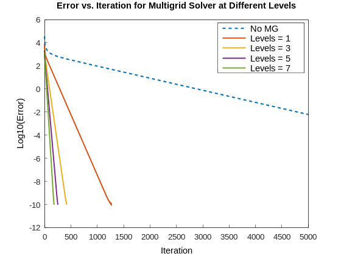

# Multigrid
This project solves the 2D Poisson equation using Multigrid with Gauss Seidel iterative method:

<div align="center">
    
</div>


$$
\begin{cases}
-\nabla \cdot a \nabla u = f & \text{in } \Omega, \\
u = g & \text{on } \partial \Omega.
\end{cases}
$$


### gauss_seidel_smooth method implementation
the number of smoothing iterations each sweep reduces high-frequency errors in the solution
Assuming that $a$ is a known constant, a uniform Cartesian grid with spacing $h$, the Laplacian $\nabla^2 u$ is approximated at a grid point $(i, j)$ as:

$$
\nabla^2 u \approx \frac{u_{i+1,j} + u_{i-1,j} + u_{i,j+1} + u_{i,j-1} - 4u_{i,j}}{h^2}.
$$

Substituting this into the Poisson equation $-a \nabla^2 u = f$, we get:

$$
-a \cdot \frac{u_{i+1,j} + u_{i-1,j} + u_{i,j+1} + u_{i,j-1} - 4u_{i,j}}{h^2} = f_{i,j}.
$$

Rearranging for $u_{i,j}$, we obtain the iterative update formula:

$$
u_{i,j} = \frac{1}{4} \left(u_{i+1,j} + u_{i-1,j} + u_{i,j+1} + u_{i,j-1} - \frac{h^2}{a} f_{i,j}\right).
$$


## How to use: 
### install dependency
```
apt-get install gnuplot
cd include
git clone https://github.com/alandefreitas/matplotplusplus.git
cd ..
```


### compile
```
mkdir -p build
cd build
cmake ..
make
cd ..
```

### run
```
./build/PoissonSolver
```


### Lazy Run

```
./run.sh
```

---

### Parallelization Explanation for `PoissonSolverParallel`

The `PoissonSolverParallel` code was parallelized to speed up the computation by distributing the work across multiple threads using OpenMP. Here's a breakdown of why and how specific parts were parallelized:

1. **Initialization (`initialize` method)**:
   - The initialization of the `rhs` (right-hand side) and boundary conditions for the solution `u` are independent operations for each grid point. These operations were parallelized using the `#pragma omp parallel for collapse(2)` directive, which allows multiple threads to compute values for different grid points simultaneously. This speeds up the initialization process by dividing the work across multiple threads.

2. **Gauss-Seidel Smoother (`gauss_seidel_smooth` method)**:
   - The Gauss-Seidel method involves updating each grid point based on its neighbors. This operation is also independent for each grid point, which makes it a perfect candidate for parallelization. By using `#pragma omp parallel for collapse(2)`, the loops that update the grid points `u[i][j]` are distributed among the available threads, speeding up the smoothing process.
   
3. **Residual Computation (`compute_residual` method)**:
   - The computation of the residual for each grid point is also independent. Therefore, parallelization is applied here as well, allowing multiple threads to compute the residuals for different grid points simultaneously. This is done using the `#pragma omp parallel for` directive with a reduction on the error to ensure that the error sum is correctly calculated in parallel.

4. **Residual Restriction and Correction Prolongation (`restrict_residual` and `prolong_correction` methods)**:
   - Both residual restriction (from fine to coarse grids) and correction prolongation (from coarse to fine grids) involve independent operations for each grid point. By applying `#pragma omp parallel for`, the operations for each point are parallelized across threads, reducing the overall computation time for these methods.

5. **V-cycle (`v_cycle` method)**:
   - The V-cycle method, which is the core of the multigrid algorithm, is parallelized by breaking down the operations for each grid point into separate tasks for different threads. The smoothing, residual computation, and correction prolongation steps in the V-cycle are all parallelized, allowing the solver to take advantage of multiple processors.

6. **General Parallelization Strategy**:
   - The parallelization was done using `#pragma omp parallel for` directives with the `collapse(2)` clause to handle two-dimensional loops efficiently. The number of threads is set to 8 using `num_threads(8)`, which controls the degree of parallelism. The parallelization improves performance by executing independent operations concurrently across multiple processors.

In summary, the key parts of the code that were parallelized involve independent operations for each grid point, making them suitable for parallel execution. By parallelizing these operations, the solver can handle larger grid sizes and solve the Poisson equation more efficiently.