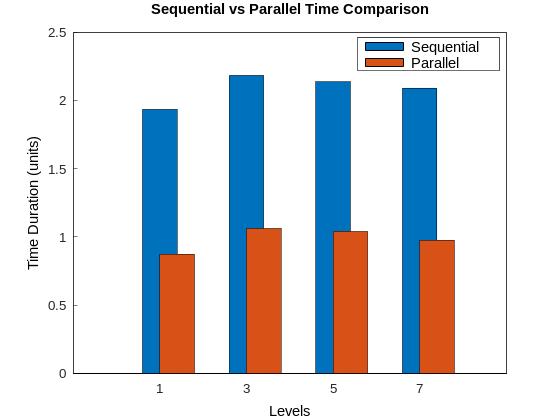

# Multigrid 2D Poisson Solver

## Table of Contents
- [Overview](#overview)
- [Mathematical Formulation](#mathematical-formulation)
- [Features](#features)
- [Installation](#installation)
- [Usage](#usage)
- [Parallelization](#parallelization)

---

## Overview

This repository contains an implementation of a **2D Poisson Equation Solver** using **Multigrid Methods** combined with the **Jacobi iterative smoothing technique**. It is designed primarily for educational and research purposes in computational science and numerical methods. The solver can handle large grids efficiently and leverages multicore parallelism through OpenMP.
$$
\begin{cases}
-\nabla \cdot a \nabla u = f & \text{in } \Omega, \\
u = g & \text{on } \partial \Omega.
\end{cases}
$$

The solution is achieved using a **Multigrid Method**, which accelerates convergence by addressing errors across different scales, combined with the **Jacobi iterative method** for smoothing. The implementation also supports parallelization using OpenMP for improved performance.

---

## Mathematical Formulation

Assuming:
- \(a\) is a known constant,
- A uniform Cartesian grid with spacing \(h\),

The Laplacian is approximated as:

$$
\nabla^2 u \approx \frac{u_{i+1,j} + u_{i-1,j} + u_{i,j+1} + u_{i,j-1} - 4u_{i,j}}{h^2}.
$$

Substituting into the Poisson equation, the iterative update formula becomes:

$$
u_{i,j} = \frac{1}{4} \left(u_{i+1,j} + u_{i-1,j} + u_{i,j+1} + u_{i,j-1} - \frac{h^2}{a} f_{i,j}\right).
$$

---

## Features

- **Multigrid V-Cycle:** Rapidly reduces both high- and low-frequency errors, accelerating convergence compared to classical iterative methods.
- **Jacobi Smoothing:** Simple yet effective iterative method that eliminates high-frequency error components.
- **OpenMP Parallelization:** Distributes work across multiple CPU cores, enabling faster solves on large grids.
- **Flexible Parameters:** Easily modify problem setups, grid sizes, and iteration counts.
- **Visual Outputs:** Generate convergence plots to diagnose and visualize solver performance.

---

## Installation

### Prerequisites
- **Compiler:** C++11 compatible compiler
- **CMake:** Version 3.28
- **Gnuplot:** For generating plots
- **OpenMP:** For parallel execution (often included in major compilers)
- **Operating System:** Linux (tested), macOS (untested), Windows (untested)

### Dependency Installation
Clone and build the required library for visualization:

```bash
apt-get update
apt-get install gnuplot
cd include
git clone https://github.com/alandefreitas/matplotplusplus.git
cd ..
```

### Compile the solver

```
mkdir -p build
cd build
cmake ..
make
cd ..
```

### Run the solver

```
./build/PoissonSolver
```

### Or simply use the provided script for convenience

```
./run.sh
```
## Usage

### 1. Run the Solver
To compute the solution for a predefined problem setup, simply execute the solver directly. Ensure that you have the necessary dependencies and environment variables set up before running. The solver will use its default parameters if you don’t specify any custom settings.

### 2. Modify Parameters
If you wish to customize the problem’s parameters (such as grid size, boundary conditions, smoothing iterations, etc.), you can edit these values in the solver’s source files. This approach allows you to tailor the solver to different scenarios or test cases.

**Steps to modify parameters:**
1. Open `\data\config.txt` .
2. Change the values of parameters like grid size `N`, constant `a`, or `max_iter`.
3. Modify forcing_function to the desired problem to solve
4. If the boundary_path is not provided in config, it will use the analytical_function present in the code.
5. Rebuild the solver to apply the changes.

### 3. View Results
The solver will print its results directly to the console, allowing you to monitor progress as the computation proceeds. Additionally, the solver saves the plot as a png to  for visualization.

<div align="center">
    
    
</div>


## Parallelization
The code uses OpenMP to distribute computations across multiple threads, enhancing performance for large problems. The default number of threads is set to the number of cores of the machine.